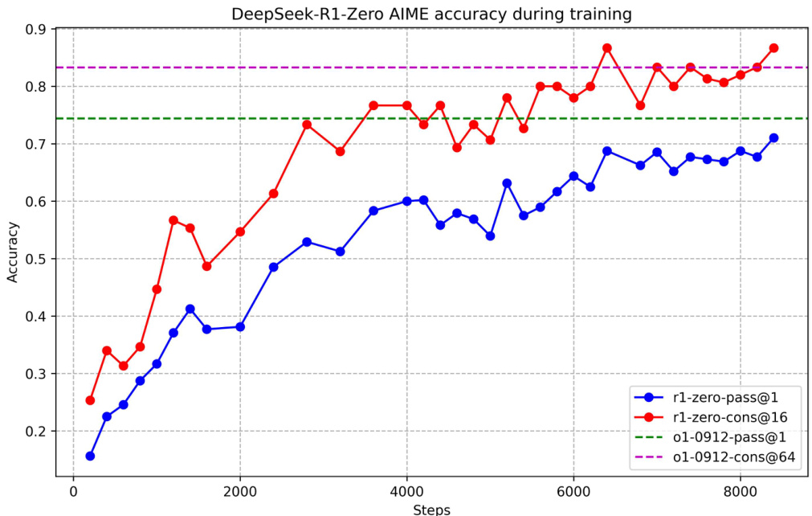
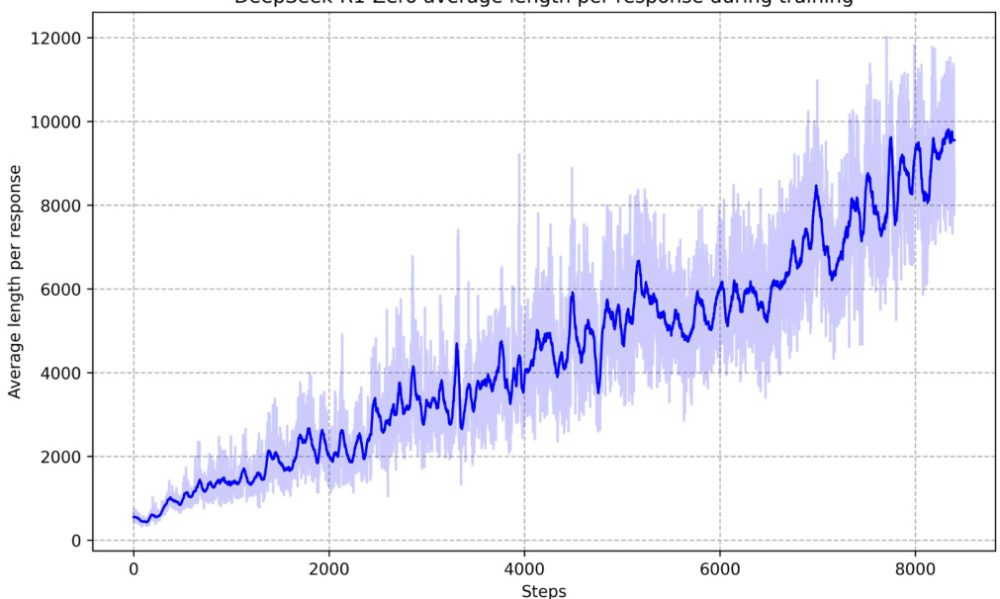

Table 1 | Template for DeepSeek-R1-Zero. prompt willbe replaced with the specific reasoning question during training.   

<html><body><table><tr><td>A conversation between User and Assistant. The user asks a question, and the Assistant solves it. The assistant first thinks about the reasoning process in the mind and then provides the user with the answer. The reasoning process and answer are enclosed within <think> </think> and <answer> </answer> tags, respectively, i.e.,<think> reasoning process here </think> <answer> answer here </answer>. User: prompt.Assistant:</td></tr></table></body></html>  

# 2.2.2. Reward Modeling  

The reward is the source of the training signal, which decides the optimization direction of RL. To train DeepSeek-R1-Zero, we adopt a rule-based reward system that mainly consists of two types of rewards:  

· Accuracy rewards: The accuracy reward model evaluates whether the response is correct. For example, in the case of math problems with deterministic results, the model is required to provide the final answer in a specified format (e.g., within a box), enabling reliable rule-based verification of correctness. Similarly, for LeetCode problems, a compiler can be used to generate feedback based on predefined test cases.   
· Format rewards: In addition to the accuracy reward model, we employ a format reward model that enforces the model to put its thinking process between '<think>' and $'_{<}$ /think>' tags.  

We do not apply the outcome or process neural reward model in developing DeepSeek-R1-Zero, because we find that the neural reward model may sufer from reward hacking in the large-scale reinforcement learning process, and retraining the reward model needs additional training resources and it complicates the whole training pipeline.  

# 2.2.3. Training Template  

To train DeepSeek-R1-Zero, we begin by designing a straightforward template that guides the base model to adhere to our specified instructions. As depicted in Table 1, this template requires DeepSeek-R1-Zero to first produce a reasoning process, followed by the final answer. We intentionally limit our constraints to this structural format, avoiding any content-specific biases—such as mandating reflective reasoning or promoting particular problem-solving strategies—to ensure that we can accurately observe the model's natural progression during the RL process.  

# 2.2.4. Performance, Self-evolution Process and Aha Moment of DeepSeek-R1-Zero  

Performance of DeepSeek-R1-Zero Figure 2 depicts the performance trajectory of DeepSeekR1-Zero on the AIME 2024 benchmark throughout the RL training process. As illustrated, DeepSeek-R1-Zero demonstrates a steady and consistent enhancement in performance as the RL training advances. Notably, the average pass $@1$ score on AIME 2024 shows a significant increase, jumping from an initial $15.6\%$ to an impressive $71.0\%$ , reaching performance levels comparable to OpenAI-ol-0912. This significant improvement highlights the efficacy of our RL algorithm in optimizing the model's performance over time.  

Table 2 provides a comparative analysis between DeepSeek-R1-Zero and OpenAI's o1-0912 models across a variety of reasoning-related benchmarks. The findings reveal that RL empowers  

Table 2 | Comparison of DeepSeek-R1-Zero and OpenAI o1 models on reasoning-related benchmarks.   

<html><body><table><tr><td rowspan="2">Model</td><td colspan="2">AIME 2024</td><td rowspan="2">MATH-500</td><td rowspan="2">GPQA Diamond</td><td rowspan="2">LiveCode Bench</td><td rowspan="2">CodeForces</td></tr><tr><td>pass@1</td><td>cons@64</td></tr><tr><td>OpenAI-o1-mini</td><td>63.6</td><td>80.0</td><td>90.0 pass@1</td><td>60.0 pass@1</td><td>53.8 pass@1</td><td>rating</td></tr><tr><td>OpenAI-o1-0912</td><td>74.4</td><td>83.3</td><td>94.8</td><td>77.3</td><td>63.4</td><td>1820 1843</td></tr><tr><td>DeepSeek-R1-Zero</td><td>71.0</td><td>86.7</td><td>95.9</td><td>73.3</td><td>50.0</td><td>1444</td></tr></table></body></html>  

  
Figure 2 | AIME accuracy of DeepSeek-R1-Zero during training. For each question, we sample 16 responses and calculate the overall average accuracy to ensure a stable evaluation.  

DeepSeek-R1-Zero to attain robust reasoning capabilities without the need for any supervised fine-tuning data. This is a noteworthy achievement, as it underscores the model's ability to learn and generalize effectively through RL alone. Additionally, the performance of DeepSeekR1-Zero can be further augmented through the application of majority voting. For example, when majority voting is employed on the AIME benchmark, DeepSeek-R1-Zero's performance escalates from $71.0\%$ to $86.7\%$ , thereby exceeding the performance of OpenAI-o1-0912. The ability of DeepSeek-R1-Zero to achieve such competitive performance, both with and without majority voting, highlights its strong foundational capabilities and its potential for further advancements in reasoning tasks.  

Self-evolution Process of DeepSeek-R1-Zero The self-evolution process of DeepSeek-R1-Zero is a fascinating demonstration of how RL can drive a model to improve its reasoning capabilities autonomously. By initiating RL directly from the base model, we can closely monitor the model's progression without the influence of the supervised fine-tuning stage. This approach provides a clear view of how the model evolves over time, particularly in terms of its ability to handle complex reasoning tasks.  

As depicted in Figure 3, the thinking time of DeepSeek-R1-Zero shows consistent improvement throughout the training process. This improvement is not the result of external adjustments but rather an intrinsic development within the model. DeepSeek-R1-Zero naturally acquires the ability to solve increasingly complex reasoning tasks by leveraging extended test-time computation. This computation ranges from generating hundreds to thousands of reasoning tokens, allowing the model to explore and refine its thought processes in greater depth.  

  
DeepSeek-Rl-Zero average length per response during training   
Figure 3| The average response length of DeepSeek-R1-Zero on the training set during the RL process. DeepSeek-R1-Zero naturally learns to solve reasoning tasks with more thinking time.  

One of the most remarkable aspects of this self-evolution is the emergence of sophisticated behaviors as the test-time computation increases. Behaviors such as reflection-where the model revisits and reevaluates its previous steps—and the exploration of alternative approaches to problem-solving arise spontaneously. These behaviors are not explicitly programmed but instead emerge as a result of the model's interaction with the reinforcement learning environment. This spontaneous development significantly enhances DeepSeek-R1-Zero's reasoning capabilities, enabling it to tackle more challenging tasks with greater efficiency and accuracy.  

Aha Moment of DeepSeek-R1-Zero A particularly intriguing phenomenon observed during the training of DeepSeek-R1-Zero is the occurrence of an "aha moment". This moment, as illustrated in Table 3, occurs in an intermediate version of the model. During this phase, DeepSeek-R1-Zero learns to allocate more thinking time to a problem by reevaluating its initial approach. This behavior is not only a testament to the model's growing reasoning abilities but also a captivating example of how reinforcement learning can lead to unexpected and sophisticated outcomes.  

This moment is not only an "aha moment" for the model but also for the researchers observing its behavior. It underscores the power and beauty of reinforcement learning: rather than explicitly teaching the model on how to solve a problem, we simply provide it with the right incentives, and it autonomously develops advanced problem-solving strategies. The "aha moment" serves as a powerful reminder of the potential of RL to unlock new levels of intelligence in artificial systems, paving the way for more autonomous and adaptive models in the future.  