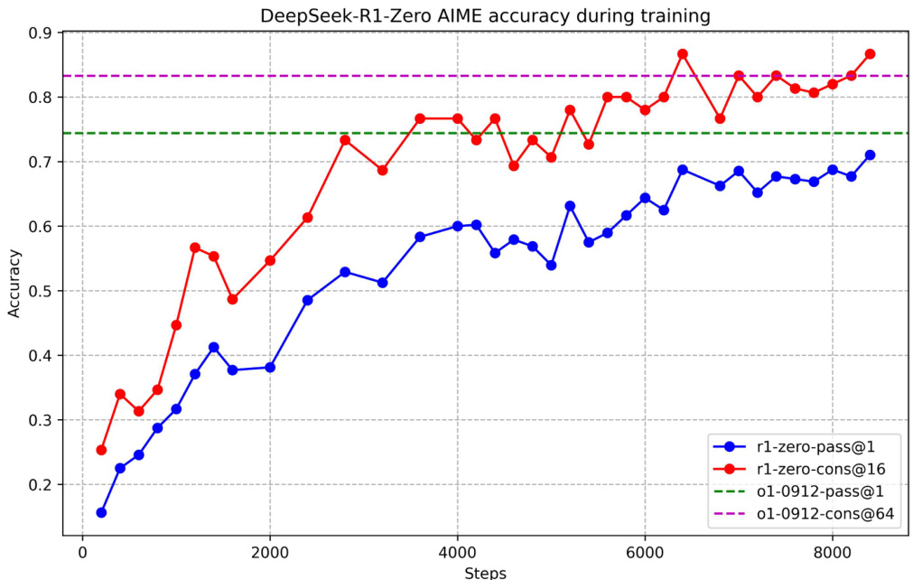
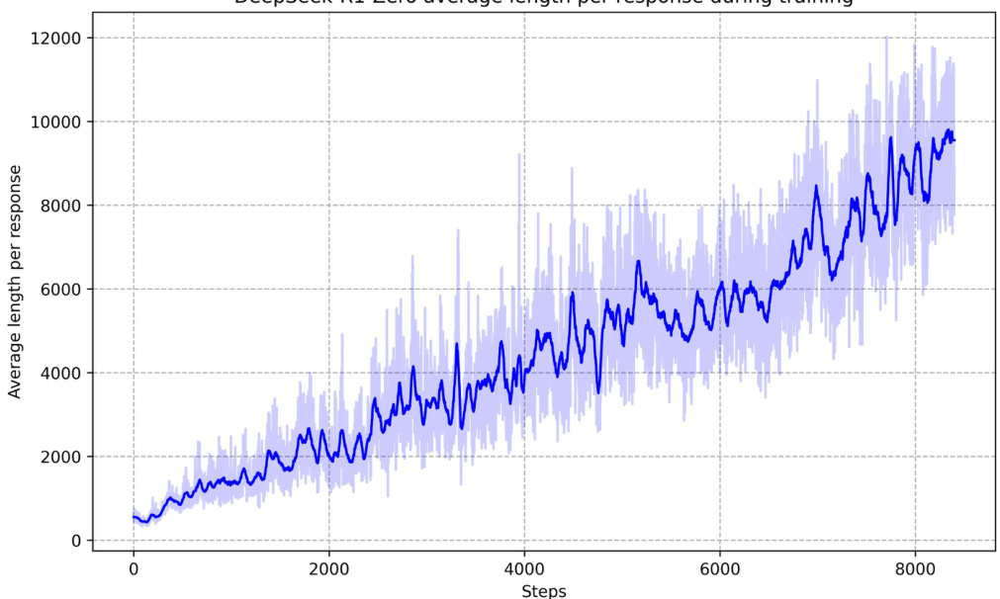

表1|DeepSeek-R1-Zero模板。在训练过程中，提示将被具体的推理问题所取代。   

<html><body><table><tr><td>A conversation between User and Assistant. The user asks a question, and the Assistant solves it. The assistant first thinks about the reasoning process in the mind and then provides the user with the answer. The reasoning process and answer are enclosed within <think> </think> and <answer> </answer> tags, respectively, i.e.,<think> reasoning process here </think> <answer> answer here </answer>. User: prompt.Assistant:</td></tr></table></body></html>  

# 2.2.2.奖励建模  

奖励是训练信号的来源，它决定了RL的优化方向。为了训练DeepSeek-R1-Zero，我们采用了一种基于规则的奖励系统，主要由两种类型的奖励组成：  

·准确性奖励：准确性奖励模型评估响应是否正确。例如，在具有确定性结果的数学问题的情况下，模型需要以指定的格式（例如，在框内）提供最终答案，从而能够对正确性进行可靠的基于规则的验证。同样，对于LeetCode问题，可以使用编译器根据预定义的测试用例生成反馈。   
·格式奖励：除了准确性奖励模型外，我们还采用了一种格式奖励模型，该模型强制将其思维过程置于“<think>”和“<think>>”之间$'_{<}$/think>'标签。  

我们在开发DeepSeek-R1-Zero时没有应用结果或过程神经奖励模型，因为我们发现神经奖励模型可能会在大规模强化学习过程中受到奖励黑客的攻击，而重新训练奖励模型需要额外的训练资源，这使整个训练管道变得复杂。  

# 2.2.3.培训模板  

为了训练DeepSeek-R1-Zero，我们首先设计了一个简单的模板，引导基础模型遵守我们指定的指令。如表1所示，该模板要求DeepSeek-R1-Zero首先生成推理过程，然后生成最终答案。我们有意将约束限制在这种结构格式上，避免任何特定于内容的偏见，例如强制进行反思性推理或推广特定的问题解决策略，以确保我们能够在强化学习过程中准确观察模型的自然进程。  

# 2.2.4.DeepSeek-R1-Zero的性能、自演化过程和Aha时刻  

DeepSeek-R1-Zero的性能图2描绘了DeepSeekR1-Zero在整个RL训练过程中在AIME 2024基准上的性能轨迹。如图所示，随着强化学习训练的推进，DeepSeek-R1-Zero的性能稳步提高。值得注意的是，平均通过率$@1$AIME 2024的得分从初始值大幅上升$15.6\%$令人印象深刻$71.0\%$，达到了与OpenAI-ol-0912相当的性能水平。这一显著改进突显了我们的RL算法在优化模型性能方面的有效性。  

表2提供了DeepSeek-R1-Zero和OpenAI的o1-0912模型在各种推理相关基准测试中的比较分析。研究结果表明，RL能够增强  

表2|DeepSeek-R1-Zero和OpenAI o1模型在推理相关基准上的比较。   

<html><body><table><tr><td rowspan="2">Model</td><td colspan="2">AIME 2024</td><td rowspan="2">MATH-500</td><td rowspan="2">GPQA Diamond</td><td rowspan="2">LiveCode Bench</td><td rowspan="2">CodeForces</td></tr><tr><td>pass@1</td><td>cons@64</td></tr><tr><td>OpenAI-o1-mini</td><td>63.6</td><td>80.0</td><td>90.0 pass@1</td><td>60.0 pass@1</td><td>53.8 pass@1</td><td>rating</td></tr><tr><td>OpenAI-o1-0912</td><td>74.4</td><td>83.3</td><td>94.8</td><td>77.3</td><td>63.4</td><td>1820 1843</td></tr><tr><td>DeepSeek-R1-Zero</td><td>71.0</td><td>86.7</td><td>95.9</td><td>73.3</td><td>50.0</td><td>1444</td></tr></table></body></html>  

  
图2|DeepSeek-R1-Zero在训练期间的AIME精度。对于每个问题，我们抽取16个答案并计算总体平均准确率，以确保稳定的评估。  

DeepSeek-R1-Zero无需任何监督微调数据即可获得强大的推理能力。这是一项值得注意的成就，因为它强调了该模型仅通过RL有效学习和推广的能力。此外，DeepSeekR1 Zero的性能可以通过多数投票的应用进一步增强。例如，当AIME基准采用多数投票时，DeepSeek-R1-Zero的表现从$71.0\%$向$86.7\%$从而超越了OpenAI-o1-0912的性能。DeepSeek-R1-Zero在有和没有多数投票的情况下都能实现如此有竞争力的性能，这突显了其强大的基础能力及其在推理任务方面进一步发展的潜力。  

DeepSeek-R1-Zero的自进化过程是一个引人入胜的演示，展示了RL如何驱动模型自主提高其推理能力。通过直接从基础模型启动RL，我们可以密切监控模型的进展，而不受监督微调阶段的影响。这种方法清晰地展示了模型如何随时间演变，特别是在处理复杂推理任务的能力方面。  

如图3所示，DeepSeek-R1-Zero的思考时间在整个训练过程中持续改善。这种改进不是外部调整的结果，而是模型内部的内在发展。DeepSeek-R1-Zero通过利用扩展的测试时间计算，自然获得了解决日益复杂的推理任务的能力。这种计算范围从生成数百到数千个推理令牌，使模型能够更深入地探索和完善其思维过程。  

  
DeepSeek Rl训练期间每次响应的平均长度为零   
图3|RL过程中DeepSeek-R1-Zero在训练集上的平均响应长度。DeepSeek-R1-Zero自然会学会用更多的思考时间来解决推理任务。  

这种自我进化最显著的方面之一是随着测试时间计算的增加，复杂行为的出现。模型修改和重新评估其先前步骤的反思等行为，以及探索解决问题的替代方法，都是自发产生的。这些行为不是明确编程的，而是模型与强化学习环境交互的结果。这种自发开发显著增强了DeepSeek-R1-Zero的推理能力，使其能够以更高的效率和准确性处理更具挑战性的任务。  

DeepSeek-R1-Zero训练过程中观察到的一个特别有趣的现象是“啊哈时刻”的发生。如表3所示，这一时刻发生在模型的中间版本中。在此阶段，DeepSeek-R1-Zero通过重新评估其初始方法，学会为问题分配更多的思考时间。这种行为不仅证明了模型不断增长的推理能力，也是强化学习如何产生意想不到的复杂结果的一个迷人例子。  

这一时刻不仅是模型的“顿悟时刻”，也是研究人员观察其行为的时刻。它强调了强化学习的力量和美丽：我们不是明确地教授模型如何解决问题，而是简单地为其提供正确的激励，它自主地开发出先进的解决问题的策略。“顿悟时刻”有力地提醒我们，强化学习有潜力在人工系统中解锁新的智能水平，为未来更自主和自适应的模型铺平道路。  